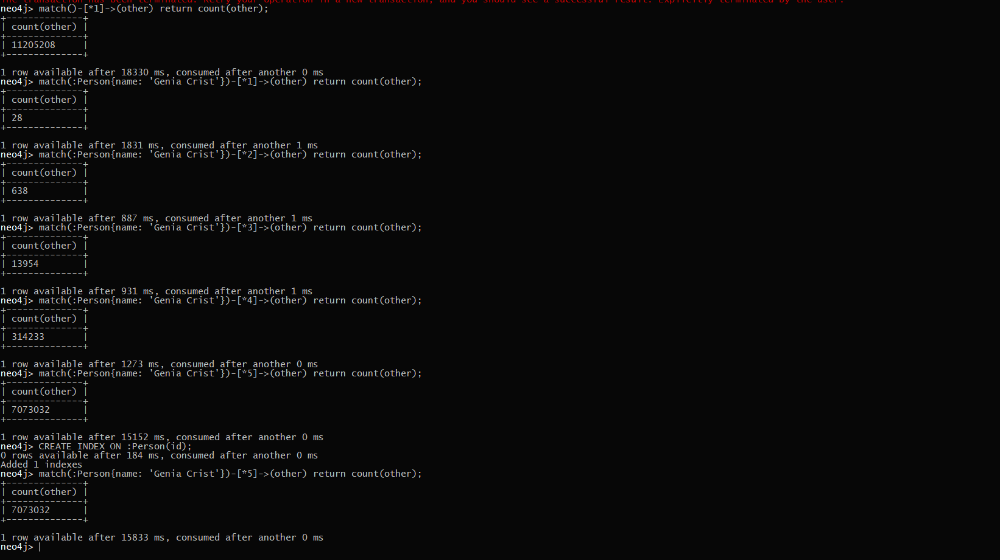

# About this project

**IMPORTANT READING**

I had a problem with Neo4j which I tried to solve but without any luck. The problem was that I couldn't connect either from the browser or from my Java appclication. BUT what I could do, was connecting to the Neo4j through the CLI without any problems with this command: 
```java 
docker exec -it neo4j bash -c 'cypher-shell -u neo4j -p class'
``` 
Here I had no problems, and I filled my database with data and could get data from it:


But because I had these problems with neo4j I couldn't measure the difference in execusion time.
So this project is based from knowledge on the difference on the two types of databases. PS. I have gotten PSQL to work in Java!

# Setup

As said, I didn't managed to get Neo4j to work in Java - but Postgresql works like a charm! Both Neo4j and Postgresql are running on a server at Digital Ocean. 

To run the program, you have to use a IDE to run java projects. The just run the Main class, and you should get execution time for the PSQL queries.

# Execution Time

The results are not very significant due to I haven't gotten measurements for Neo4j, but here is the results of the execution time for PSQL:


# Conclusion

I have got some results from a classmate on depth 5 on Neo4j. Here the results were surprisingly different from what we thought. The results were:

* Average time for depth 5:
11.985098984149996 seconds
* Median time for depth 5:
21.6451502425 seconds

which is slower than the results from PSQL.

Postgres is advanced object-relational database and Neo4j is a graph database which stores data in nodes connected by directed, typed relationships with properties on both, also known as a Property Graph.

As we know, Neo4j is supposed to be faster when going down in depth, but surprisingly this was not the case with this assingment, which we don't know why.


